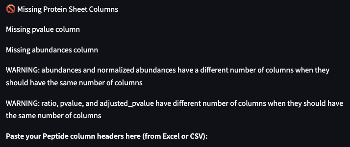

# verify-excel

A small webtool made for Kirk Lab members to check column output for Mass Spectometry spreadsheets. This app is hosted on streamlit community cloud to allow for easy access.  

## Requirements 

- A working web browser.

## Usage

Visit https://verify-ms-excel.streamlit.app/ 

If the app has not been used for a certain amount of time, streamlit will need time to spin up its servers. This usually takes 1-2 minutes.

The user should copy and paste the column headers of the specific sheet into each respective textbox, then press `Ctrl + Enter` or `Cmd + Enter` on Mac to check whether the sheet contains the correct columns.

The output will appear under the textbox, and indicate any missing columns for each protein or peptide sheet. Additionally, warnings might appear for any non-column related issues, such as the number of raw abundances and the number of normalized abundances being different. 

If the spreadsheet contains the correct columns, it will show the following:

If there are certain missing columns, it will print out the specific missing columns as well as other warnings:

